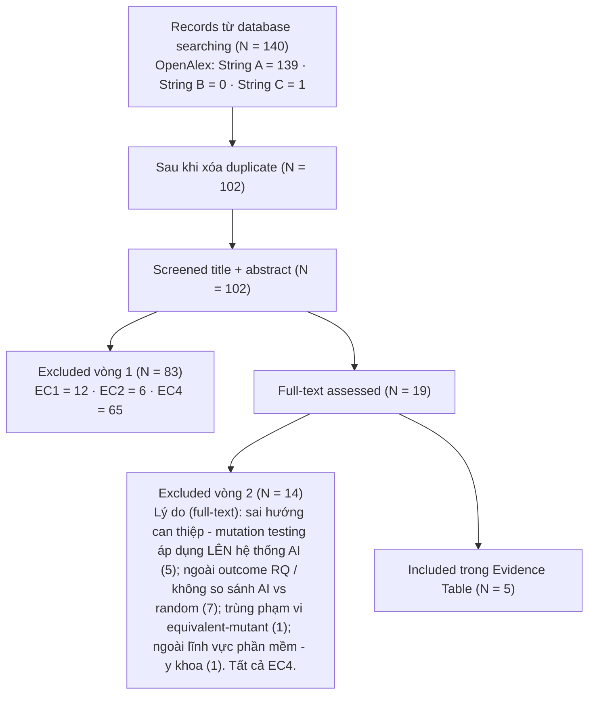

# PRISMA Flow — LLM/AI-guided Mutation Testing

```mermaid
flowchart TD
    A["Records từ database searching (N = 140)<br/>OpenAlex: String A = 139 · String B = 0 · String C = 1"]
    B["Sau khi xóa duplicate (N = 102)"]
    C["Screened title + abstract (N = 102)"]
    D["Excluded vòng 1 (N = 83)<br/>EC1 = 12 · EC2 = 6 · EC4 = 65"]
    E["Full-text assessed (N = 19)"]
    F["Excluded vòng 2 (N = 14)<br/>Lý do (full-text): sai hướng can thiệp - mutation testing áp dụng LÊN hệ thống AI (5); ngoài outcome RQ / không so sánh AI vs random (7); trùng phạm vi equivalent-mutant (1); ngoài lĩnh vực phần mềm - y khoa (1). Tất cả EC4."]
    G["Included trong Evidence Table (N = 5)"]

    A --> B --> C
    C --> D
    C --> E
    E --> F
    E --> G
```
